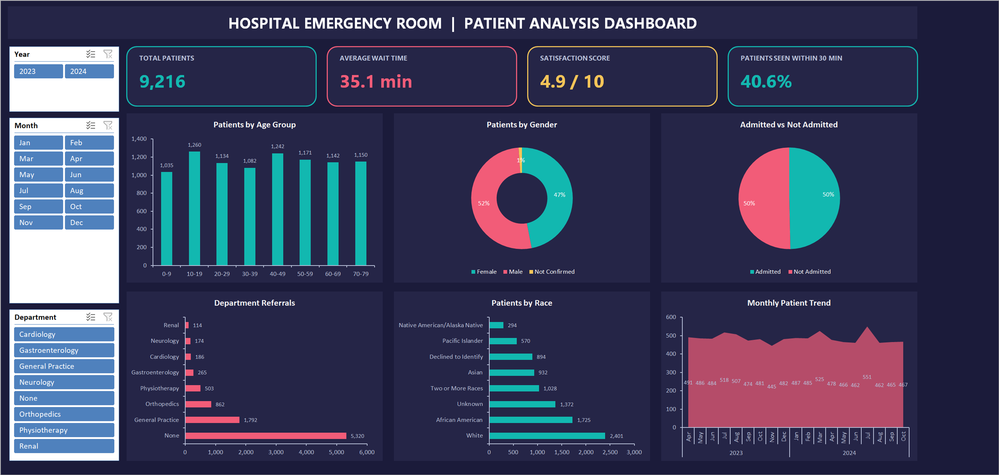

# Hospital Emergency Room — Patient Analysis Dashboard (Excel)

An end-to-end Excel analytics project: **9,216 ER patient records** cleaned, modeled and visualized as a one-page **interactive dashboard** with slicer-driven KPIs.



**Live demo (opens in Excel Online — slicers work in browser):** _link in repo description_

---

## KPIs at a Glance

| KPI | Value | Definition |
|---|---|---|
| Total Patients | **9,216** | ER visits, Apr 2023 – Oct 2024 |
| Average Wait Time | **35.1 min** | time until seen by staff |
| Satisfaction Score | **4.9 / 10** | average of rated visits |
| Seen Within 30 min | **40.6%** | wait-time SLA compliance |

## Key Insights

1. **Wait-time SLA is failing** — 59% of patients wait beyond the 30-minute target (avg 35.1 min) → triage fast-track recommended.
2. **~58% of visits require no departmental referral** — minor cases dominate; prime candidates for a GP-style fast lane.
3. **Satisfaction (4.9/10) is based on only ~25% of patients** — feedback capture needs fixing before the score can be trusted.
4. **Volume is flat (~440–550/month)** with no seasonality → stable staffing baseline.
5. **Demographics are balanced** across age bands and gender — no single cohort drives load.

## How It's Built

```
Raw_Data (messy)  →  Cleaning (16 formula columns → Excel Table)
                  →  8 PivotTables on ONE shared cache
                  →  6 PivotCharts + GETPIVOTDATA KPI cards
                  →  3 slicers (Year / Month / Department) filter EVERYTHING at once
```

| Sheet | Purpose |
|---|---|
| `Raw_Data` | 9,216 raw records — inconsistent gender codes, blank ratings, raw datetimes |
| `Cleaning` | Formula-driven transforms: gender normalization (`IF/OR`), age bucketing (`FLOOR`), 30-min SLA flag, `TEXT/YEAR/HOUR` date parts |
| `Pivot_Tables` | 8 pivots (KPI, age, gender, admission, attend-status, department, race, monthly trend) |
| `Dashboard` | Dark-themed interactive page — linked-text-box KPI cards, sorted bar/doughnut/pie/area charts, slicers with report connections |

**Excel features used:** Excel Tables · PivotTables (shared cache) · PivotCharts · Slicers + Report Connections · `GETPIVOTDATA` · `TEXT` / `FLOOR` / nested `IF-OR` · linked text boxes · custom-list month sorting · dark dashboard design.

## Use It

1. Download [`Hospital_ER_Dashboard.xlsx`](Hospital_ER_Dashboard.xlsx) and open in Excel (desktop or web).
2. Go to the **Dashboard** sheet → click any slicer → all KPIs and charts update together.
3. Add new rows to `Raw_Data` → **Data ▸ Refresh All** re-runs the entire pipeline.

## Files

- `Hospital_ER_Dashboard.xlsx` — the interactive workbook
- `Hospital_ER_Data.csv` — raw dataset
- `dashboard.png` / `Dashboard_Preview.pdf` — dashboard snapshots

---

*Dataset is synthetic (privacy-safe) and mirrors the widely used Hospital ER patient dataset. Project format inspired by Satish Dhawale's Excel dashboard tutorial.*
